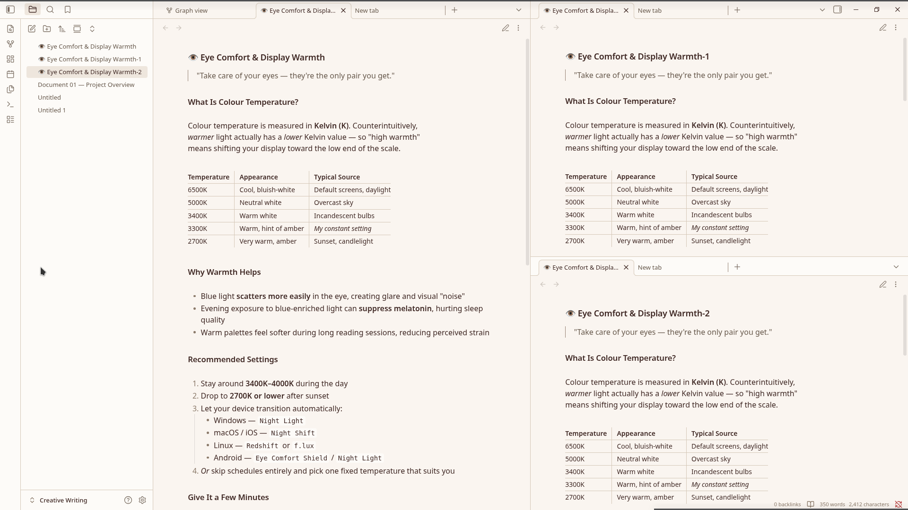
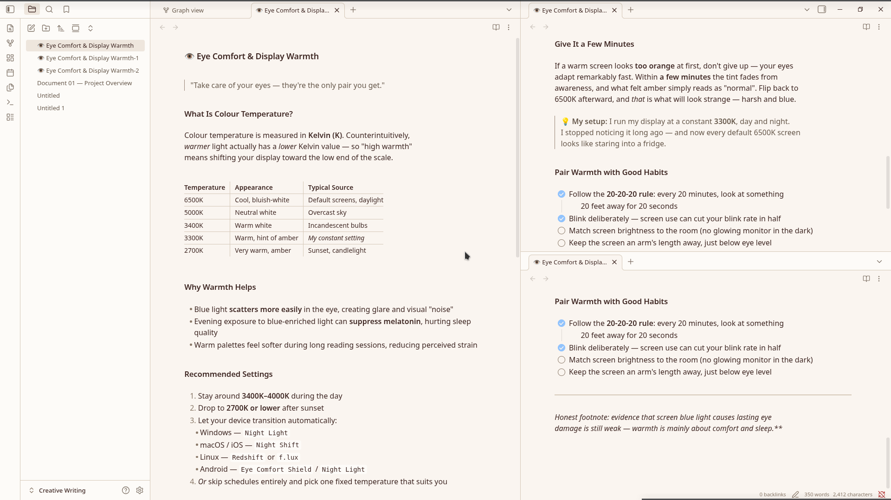
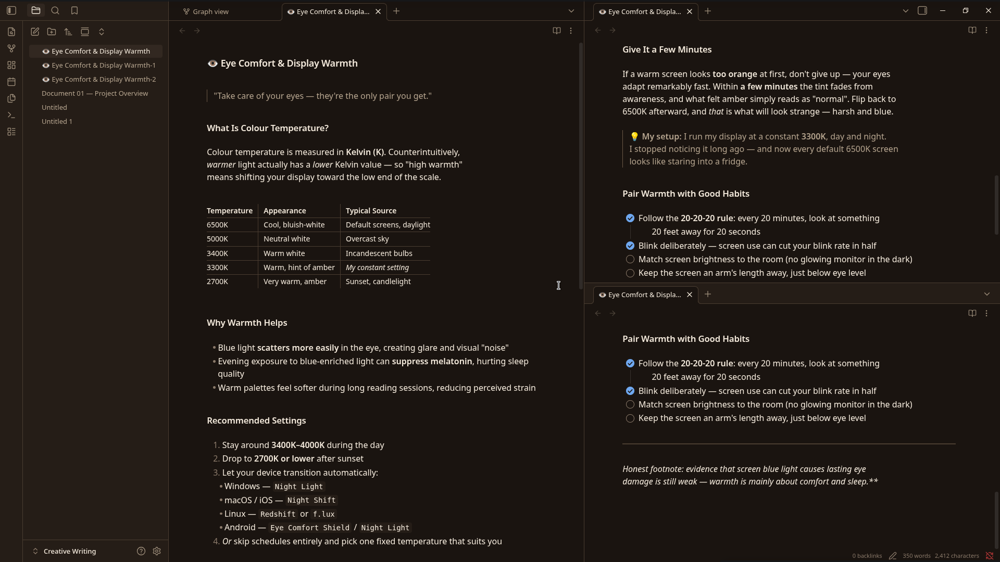
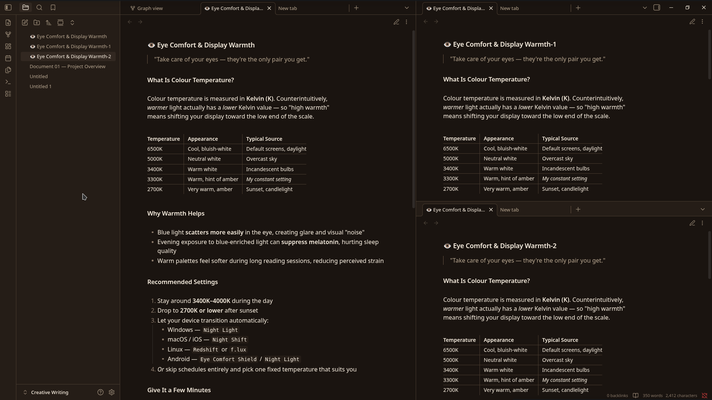

# Ivory Garden

A warm, paper-light Obsidian theme built for long reading sessions. Ivory and cream backgrounds carry deep cocoa text, with a single cobalt blue accent and a signature muted gold glow for highlights — designed to feel like an ivory garden at golden hour.

Ivory Garden is a recolour of [Minimal](https://github.com/kepano/obsidian-minimal) v9.0.2 by [@kepano](https://twitter.com/kepano). All credit for the theme architecture, feature set, plugin compatibility, and Style Settings surface goes to Steph Ango. This repo only changes the color values.

## Why Ivory Garden?

Most light themes default to pure white backgrounds with pure black text. After a few hours of reading, that's harsh on the eyes. Ivory Garden takes a different approach:

- **Ivory paper, not white** — backgrounds use `#FAF5F0` (warm ivory) instead of `#FFFFFF`. Less blue light, less fatigue, more "printed book" feel.
- **Cocoa text, not black** — body text uses `#3E2723` (deep cocoa brown) instead of pure black. The contrast is still excellent, but the page reads softer.
- **A single cool accent** — cobalt blue `#0B68DA` for links and interactive elements. Cool enough to stand out against the warm paper, saturated enough to read as deliberate.
- **A signature gold glow** — text highlights use muted gold `#C49A3C`, not yellow. The result feels like sunlight through bokeh, not a highlighter pen.

The dark variant (**Midnight Garden**) inverts the same palette: espresso-black backgrounds with warm ivory text, a lightened cobalt accent, and a brighter gold glow that survives the darkness.

## Screenshots

| Light mode — editor | Dark mode — editor |
|---|---|
|  |  |

| Light mode — reading | Dark mode — reading |
|---|---|
|  |  |

## Install

### From Obsidian (after community directory approval)

1. Open **Settings → Appearance → Themes → Manage**
2. Search for **"Ivory Garden"**
3. Click **Install**, then **Use**
4. Toggle between light and dark via **Settings → Appearance → Base color scheme**

### Manual install

1. Download the [latest release](https://github.com/W-O-Debian/ivory-garden/releases) `.zip`
2. Extract into your vault's `.obsidian/themes/Ivory Garden/` directory
   - The folder name **must** be exactly `Ivory Garden` (with a space) — it must match the `name` field in `manifest.json`
3. In Obsidian: **Settings → Appearance → Themes → Manage**, then select **Ivory Garden**

### Companion plugins (recommended)

Ivory Garden inherits Minimal's full feature set. For complete control over features like focus mode, table styles, tab styles, and color schemes, install:

- **[Minimal Theme Settings](https://github.com/kepano/obsidian-minimal-settings)** — adds a settings panel for all Minimal features
- **[Hider](https://github.com/kepano/obsidian-hider)** — hides UI elements for distraction-free writing
- **[Style Settings](https://github.com/mgmeyers/obsidian-style-settings)** — exposes Ivory Garden's full Style Settings panel for granular color customization

## Palette

### Light mode (default)

| Role | Hex | Use |
|---|---|---|
| Background | `#FAF5F0` | Editor canvas, primary surface |
| Card / Surface | `#FDFBF8` | Sidebars, ribbon, modals |
| Popover / Hover | `#EEE6DD` | Hover states, active selection |
| Border | `#968374` | Dividers, button borders |
| Foreground | `#3E2723` | Body text — deep cocoa |
| Muted text | `#67594C` | Secondary text — walnut |
| Accent | `#0B68DA` | Links, focus rings — cobalt blue |
| Accent hover | `#094FA6` | Hovered links |
| Accent interactive | `#91C3FD` | Toggles, buttons — sky blue |
| **Signature glow** | `#C49A3C` | Text highlights — muted gold |

### Dark mode (Midnight Garden)

| Role | Hex | Use |
|---|---|---|
| Background | `#1A1410` | Espresso black |
| Card / Surface | `#251D17` | Dark cocoa |
| Popover / Hover | `#322821` | Warm umber |
| Border | `#6B5947` | Warm bronze |
| Foreground | `#F5EBDD` | Warm ivory |
| Muted text | `#B5A48E` | Sand |
| Accent | `#6FA8F0` | Lightened cobalt |
| Accent hover | `#91C3FD` | Sky blue |
| **Signature glow** | `#E2B860` | Brightened gold |

## What's included

Because Ivory Garden is a Minimal recolour, you inherit the full Minimal feature set:

- **Focus mode** — auto-hides ribbon, tabs, status bar; reveals on hover
- **Cards** — Dataview tables and lists render as responsive card grids
- **Image grid** — adjacent images auto-arrange into a grid
- **Table helpers** — row/column lines, striped rows, row numbers, tabular figures, centered tables, and more
- **Tab styles** — default, square, underline, modern; sidebar variants
- **Callouts** — filled or outlined
- **Embeds** — strict, hide-title, underline
- **Heading dividers** — optional underline below H1–H6
- **Tag styles** — plain, bordered pill, rounded, square
- **Image tweaks** — `#invert`, `#blend`, `#circle`, `#outline`, `#interface` URL suffixes
- **Plugin compatibility** — Calendar, Charts, Dataview, Git, Kanban, Style Settings, Zoom, and more
- **14 preset color schemes** — Dracula, Gruvbox, Nord, Solarized, Catppuccin, and more (Minimal's presets remain selectable for comparison)

### New in v1.1.0

- **Warm Toggle** — reduces blue light for nighttime reading via a 50% color temperature shift. Toggle in Style Settings → Advanced → "Warm shift", or add `warm-shift` as a cssclass on any note.
- **True Focus Mode** — hides everything except the note workspace. More aggressive than Minimal's built-in focus mode. Toggle in Style Settings → Advanced → "True focus mode", or add `true-focus-mode` as a cssclass.
- **PDF Export styling** — Obsidian's "Export to PDF" now produces beautiful theme-colored PDFs with proper page margins, preserved callouts, and the signature gold glow on highlights.
- **Custom syntax highlighting** — code blocks now use palette-tuned colors (keywords in cobalt, strings in dusty teal, comments in walnut, functions in gold).
- **Graph view preset** — the graph view now matches the Ivory Garden palette instead of using Obsidian's defaults.

## What changed from Minimal

Only color values were changed. Specifically:

1. **Base HSL** — `--base-h/s/l` shifted to warm ivory (33°, 47%, 96%) for light, espresso (28°, 24%, 8%) for dark
2. **Accent HSL** — `--accent-h/s/l` set to cobalt blue (213°, 90%, 45%) for light, lightened cobalt (213°, 84%, 69%) for dark
3. **Pinned palette values** — `--bg1`, `--bg2`, `--bg3`, `--ui1–3`, `--tx1–4`, `--ax1–3`, `--hl1`, `--hl2`, `--sp1` pinned to palette-exact hex values (Minimal's auto-derivation formula is bypassed)
4. **Extended palette** — `--color-red` through `--color-pink` shifted to earthy, painterly tones (muted brick, sage green, dusty rose, etc.)
5. **Signature glow** — `--hl2` (text highlight background) set to muted gold `#C49A3C` at 35% opacity, brightened to `#E2B860` in dark mode
6. **Explicit scheme classes** — `.minimal-ivory-garden-light` and `.minimal-ivory-garden-dark` added for parity with Minimal's other named schemes

Everything else — layout, feature modules, plugin styles, Style Settings YAML — is unchanged from Minimal v9.0.2.

## Compatibility

- **Obsidian 1.13.0+** (per `minAppVersion`)
- **Tested on macOS, Windows, Linux, and mobile**
- All Minimal-compatible plugins work unchanged

## Demo vault

The `/demo-vault` folder contains sample notes showcasing headings, callouts, tables, code blocks, task lists, and Dataview examples. Open it in Obsidian with Ivory Garden enabled to see every feature in context.

## Credits

- **[Minimal](https://github.com/kepano/obsidian-minimal)** by [@kepano](https://twitter.com/kepano) — the entire theme architecture, feature set, plugin compatibility, and Style Settings surface. Ivory Garden would not exist without Minimal.
- **[Minimal Theme Settings](https://github.com/kepano/obsidian-minimal-settings)** — companion plugin for feature control
- **Ivory Garden palette** — designed by Ward Skaiker

## License

MIT License — same as Minimal. Copyright 2020–2026 [Steph Ango](https://twitter.com/kepano). The Ivory Garden recolour is by [Ward Skaiker](https://github.com/W-O-Debian) and is released under the same MIT License. See [LICENSE](LICENSE) for details.

## Changelog

See [CHANGELOG.md](CHANGELOG.md).
